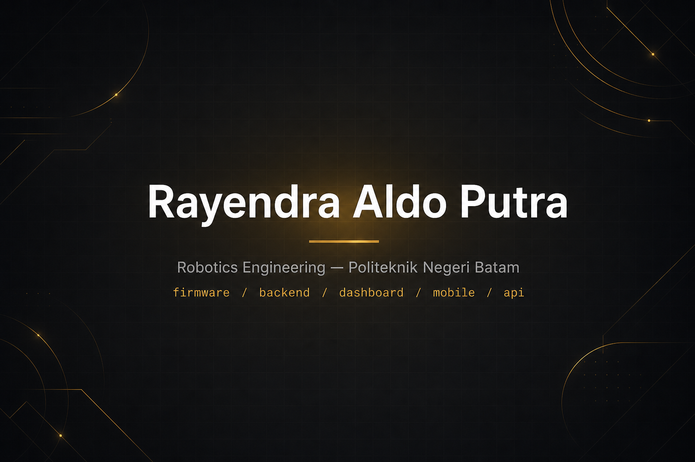
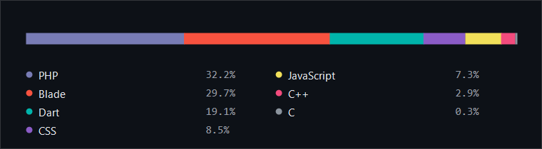

  
  
  

Saya membangun sistem dari ujung ke ujung: firmware di perangkat, API di server, dashboard untuk operator, dan aplikasi di tangan pengguna. Ketertarikan utama saya ada di titik tempat perangkat keras bertemu perangkat lunak, terutama sistem yang harus tetap bekerja saat jaringannya mati.

> **English:** Robotics engineering student building end-to-end systems — device firmware, backend APIs, operator dashboards, and mobile apps. Most interested in the seam where hardware meets software, especially systems that keep working when the network does not.

## Perkakas yang saya pakai

**Web**

**Mobile**

**Perangkat & robotika**

**Data & alat**

Di sisi perangkat saya juga bekerja dengan FreeRTOS, sensor sidik jari, RTC, dan OLED; di sisi robot dengan LiDAR, wheel encoder, dan VL53L0X; serta perancangan skema dan migrasi basis data.

## Proyek

**[aiot-simalas](https://github.com/raldoputradev/aiot-simalas)** — Sistem absensi dan loker laboratorium berbasis sidik jari, dipakai di Lab Robotika kampus. Empat lapisan dalam satu proyek: mesin ESP32 di pintu lab, API Laravel, dashboard untuk laboran dan dosen, serta aplikasi Flutter untuk mahasiswa. Pencocokan sidik jari terjadi di perangkat, bukan di server, dan tap yang gagal terkirim masuk antrean lokal lalu disinkronkan saat jaringan kembali — absensi tidak pernah berhenti karena internet lab bermasalah.

Repositori itu adalah cermin publik: seluruh kode ada di sana, tanpa satu pun data laboratorium, foto mahasiswa, atau kredensial. Ada seeder data fiktif supaya siapa pun bisa menjalankannya sendiri, dan APK aplikasi mahasiswanya bisa diunduh dari halaman rilis.

## Bahasa yang paling sering saya pakai

Sebaran ini datang dari kode nyata di [aiot-simalas](https://github.com/raldoputradev/aiot-simalas): backend Laravel dan dashboard Blade di server, aplikasi Flutter untuk mahasiswa, dan firmware C++ di mesin ESP32.

## Yang sedang saya kerjakan

Proyek berikutnya saya siapkan dulu sampai layak dipublikasikan. Yang ditampilkan sekarang hanya [aiot-simalas](https://github.com/raldoputradev/aiot-simalas).

## Kontribusi

<picture>
  <source media="(prefers-color-scheme: dark)" srcset="https://raw.githubusercontent.com/raldoputradev/raldoputradev/output/pacman-contribution-graph-dark.svg">
  <source media="(prefers-color-scheme: light)" srcset="https://raw.githubusercontent.com/raldoputradev/raldoputradev/output/pacman-contribution-graph.svg">
  
</picture>

## Kontak

Terbuka untuk kesempatan magang dan kolaborasi teknis.

- Email: raldoputra.dev@gmail.com
- LinkedIn: [rayendra-aldo-putra](https://www.linkedin.com/in/rayendra-aldo-putra-40399b400)
- Domisili: Batam, Kepulauan Riau
